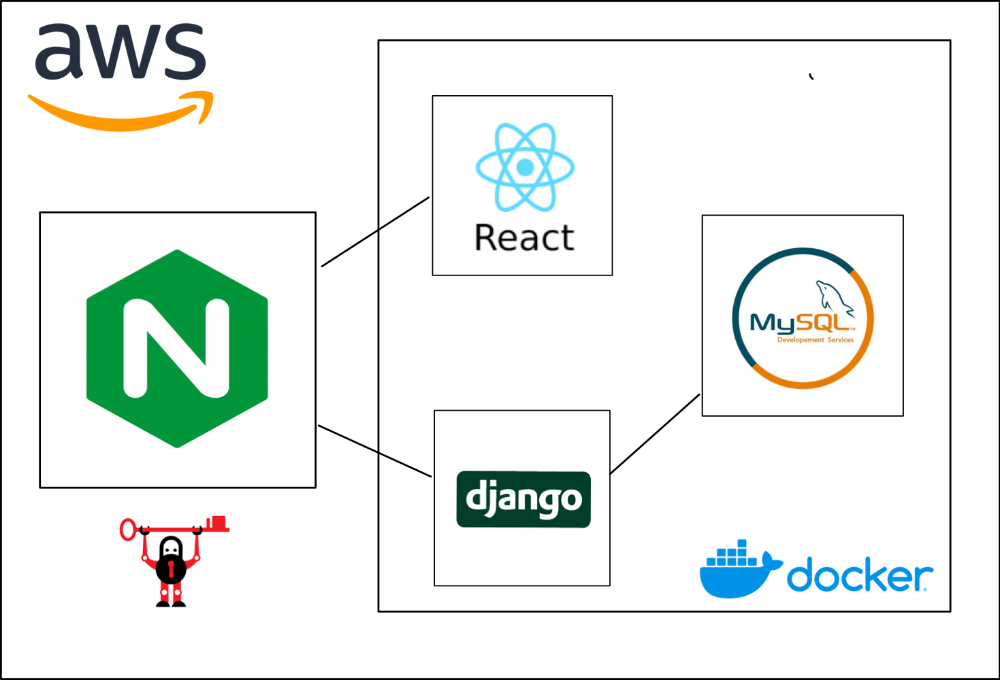

# 오디가지


## 개발환경

**각각의 서버에서 사용되는 라이브러리 등의 세부 정보는 README_front, back 을 참조해주세요.**

### Frontend

- Python:3.9.6
- URL : j6b103.p.ssafy.io

### Backend

- Framework : `Python` : 3.9.6, `Django` : 4.0.3, `djangorestframework` : 3.13.1
- IDE: `Visual Studio Code` : latest, `Pycharm Pro` : 2021.3.1
- URL : j6b103.p.ssafy.io:8000
- git에 등록하지 않은 파일 : https 인증키 

### DB

- DB : `MySQL` : 8.0.28
- Management : `MySQL Workbench` : 8.0.26
- User : `name` : root, `password` : ssafy103
- URL : 3.38.250.117:3333
- 

## 실행

```shell
# backend 폴더에서
pip install -r requirements.txt
python manage.py runserver

# frontend 폴더에서
npm install
npm start
```

자세한 내용은 README_front, back 을 참조해주세요.


## 배포
### 배포 구조



- 프론트엔드는 리액트, 백엔드는 쟝고, DB는 MySQL을 활용했다.
- 배포를 위해서 위 세가지 서버를 AWS EC2 서버 위에 Docker를 통해 올려두고 쟝고 서버와 MySQL 서버를 연결했다.
- AWS에 NGINX를 설치하고 certbot을 이용해 letenscrypt 인증을 받았다.
- ssl 인증을 받은 nginx에 리액트 서버와 쟝고 서버를 연결했다.

#### Nginx config

```nginx
# http로 들어온 요청을 https쪽으로 리다이렉트하기 위한 설정
server {
        location / {
                return 301 https://j6b103.p.ssafy.io$request_uri;
        }
}
# 도메인으로 들어온 요청을 3000번 포트(리액트 서버)로 연결하는 설정
server {

        server_name j6b103.p.ssafy.io
        listen 80 default_server;
        listen [::]:80 default_server;

        listen 443 ssl default_server;
        listen [::]:443 ssl default_server;
				# 인증받은 ssl키와 연결
        ssl_certificate /etc/letsencrypt/live/j6b103.p.ssafy.io/fullchain.pem;
        ssl_certificate_key /etc/letsencrypt/live/j6b103.p.ssafy.io/privkey.pem;

        ssl_session_cache shared:SSL:1m;
        ssl_session_timeout 10m;
        ssl_ciphers HIGH:!aNULL:!MD5;
        ssl_prefer_server_ciphers on;

        root /var/www/html;

        # Add index.php to the list if you are using PHP
        index index.html index.htm index.nginx-debian.html;

        server_name j6b103.p.ssafy.io;
        location / {
                proxy_pass http://j6b103.p.ssafy.io:3000/;

                proxy_http_version 1.1;
                proxy_set_header Upgrade $http_upgrade;
                proxy_set_header Connection "upgrade";

                proxy_set_header X-Real_IP $remote_addr;
                proxy_set_header X-Fowarded-For $proxy_add_x_forwarded_for;
                proxy_set_header Host $host;
        }
   
}
```


### 배포 과정

#### Backend

```dockerfile
FROM python:3.9.6
ENV PYTHONDONTWRITEBYTECODE=1
ENV PYTHONUNBUFFERED=1
WORKDIR /code
COPY requirements.txt /code/
RUN pip install -r requirements.txt
COPY . /code/
EXPOSE 8000

CMD ["python3", "manage.py", "runsslserver", "--certificate", "./fullchain.pem", "--key", "./privkey.pem", "0.0.0.0:8000"]
```

- https를 사용하기에 백서버에도 인증키를 두고 `django-sslserver`를 사용하여 실행하였다.

#### Frontend

```dockerfile
# Dockerfile 
FROM node:16.13.1-alpine
# set working directory
WORKDIR /app

ENV PATH /app/node_modules/.bin:$PATH

# install app dependencies
COPY package.json ./
COPY package-lock.json ./

COPY /package.json /app/package.json
RUN npm install

# add app
COPY /. ./

# start app
CMD ["npm", "run", "deploy_start"]
```

```json
// package.json
...
  "scripts": {
    "start": "react-scripts start",
    "deploy_start": "cross-env REACT_APP_ENV=production react-scripts start",
    ...
  },
...
```

```js
// server.js
const server = {
  BASE_URL: 'http://localhost:8000',
	...
};

if (process.env.REACT_APP_ENV === 'production') {
  server.BASE_URL = 'https://j6b103.p.ssafy.io:8000';
}
...
```

- `server.js`에 `deploy_start`라는 스크립트를 만들어 두고, 이 명령어로 실행할 경우 로컬 쟝고 서버가 아닌 배포되어 있는 쟝고 서버를 사용하도록 해두었다.
- 도커파일에서 실행시 `deploy_start`를 사용하게 해두었다.


#### 진행

- 쟝고와 리액트 서버를 각각 로컬환경에서 docker 이미지로 빌드한 뒤, docker hub를 이용해 aws에서 이미지를 받아와 실행했다.
- `jenkins`를 통해 깃과 aws상의 젠킨스를 연동하는 데까지는 성공했으나, 이후 진행을 위해서는 기존 배포 구조에 큰 수정이 필요하여 젠킨스 사용은 중단했다. 


